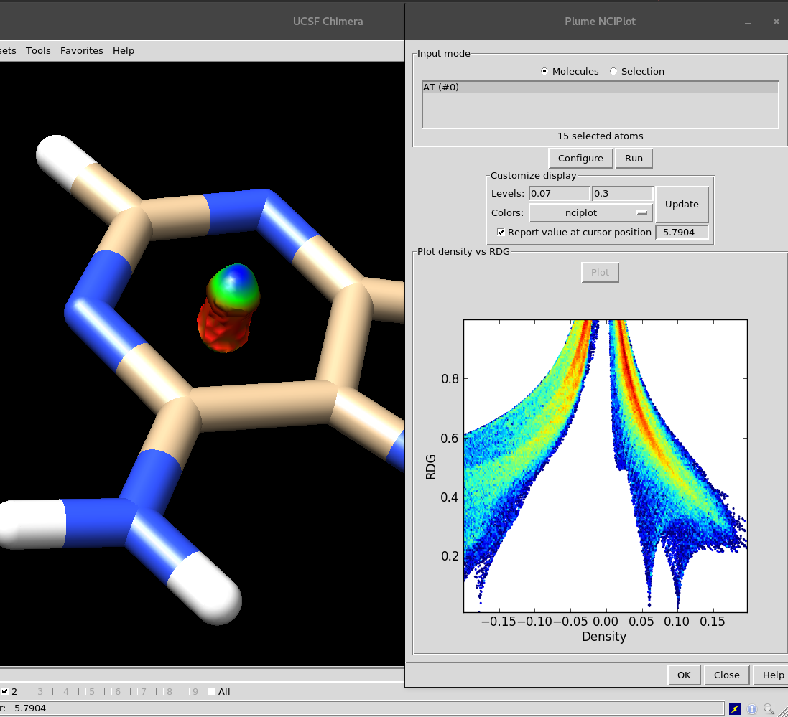

# Tangram NCIPlot GUI

NCIPlot GUI is a graphical frontend for UCSF Chimera. It runs NCIPlot behind the scenes to depict non covalent interaction blobs of the selected molecules. It also supports a CUDA GPU implementation, cuNCI.



`NCIPlot` is GPL software developed by Alberto Otero de la Roza,
Julia Conteras-Garcia, Erin R. Johnson, and Weitao Yang. Make sure to check their [GitHub](https://github.com/aoterodelaroza/nciplot).

`cuNCI` is developed by Gaëtan Rubez, Jean-Matthieu Etancelin, Xavier Vigouroux, Michael Krajecki, Jean-Charles Boisson, and Eric Hénon, and published in [JCC](http://onlinelibrary.wiley.com/doi/10.1002/jcc.24786/full).

# Dependencies
You need to download NCIPlot from [here](https://github.com/aoterodelaroza/nciplot) and configure Tangram NCIPlot so it can find the location where you extracted the files.

We also provide [Anaconda](https://www.continuum.io/) [binaries](https://anaconda.org/InsiliChem) so you can install them easily with these commands:

```
conda install -c insilichem nciplot
conda install -c insilichem cunci # only if you have a CUDA-enabled dGPU
```

# Installation
[Download](https://bitbucket.org/insilichem/nciplot/downloads) or clone this repository and extract it in any location. Then, open up Chimera and go to `Favorites> Preferences`. In the `Category` dropdown, select `Tools`. In the lower part of the dialog, under `Locations`, click on `Add` and select the parent location where you extracted NCIPlot GUI. Ie, the selected folder must contain NCIPlot.

NCIPlot GUI will take care of everything else, but if it fails, you can enter the configuration details manually with the button Configure.

# GPU support
By default, the UI will try to locate the CPU implementation (`nciplot`), but if you have installed the GPU one, you can set it manually in the Configuration dialog. The executable is called `cuda_nci` and should be located in the same folder as `nciplot`. Everything else is handled automatically.